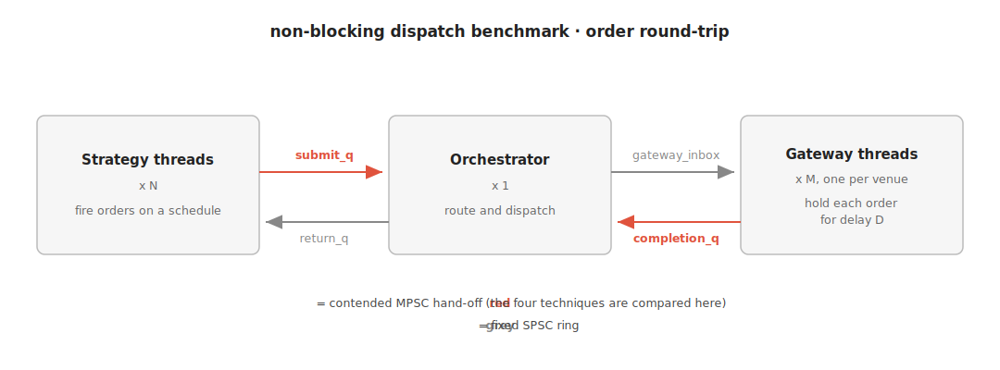

# nonblocking-dispatch-bench

A latency benchmark. It compares four non-blocking queue techniques for the
contended hand-off in an order-dispatch pipeline.



The pipeline models a trading-engine round trip. Strategy threads fire orders, a
central orchestrator routes them, and per-venue gateways hold each order for a
delay `D` (the network and the exchange). Completions travel back the same way.

Every thread busy-polls; none sleep. Each order carries 8 timestamps, so the
benchmark can break the round trip into 7 segment latencies.

The four techniques are swapped into the two contended MPSC hand-offs (submit
and completion):

1. `std::sync::mpsc`, an unbounded channel
2. `crossbeam-channel`, a bounded channel
3. `crossbeam_queue::ArrayQueue`, a single lock-free MPSC ring
4. per-producer SPSC rings with a consumer-side mux

The bounded queues never fill. The benchmark counts every Full (backpressure)
return, and the count was zero for the whole sweep, so the comparison measures
the hand-off itself, not backpressure.

## Build and run

```
cargo build --release
./target/release/nonblocking-dispatch-bench
```

Needs a recent Rust toolchain. Settings come from `config.yaml` (one
`key: value` per line); change a value and re-run, no rebuild needed. Keep
`n_strategies + m_venues + 2` within the core count.

Thread pinning uses `sched_setaffinity` (Linux only); elsewhere it is a no-op
and scheduler noise pollutes the p99.9 tail.

## Results

Setup:

| Setting | Value |
|---|---|
| Machine | AWS c7g.4xlarge (16 vCPU Graviton3, Linux, threads pinned) |
| Strategies / gateways | N = 8 / M = 4 |
| Orders per run | 4,000,000 |
| Fire window | 10 s, uniform-random (offered load ~400K/s) |
| Venue delay `D` | Uniform(5 ms, 500 ms) |
| Queue capacity | 8192 |
| Repeats | 5 |

All four techniques run on the same pre-sampled fire schedule. Each table cell
is a per-run percentile, shown as the median across the 5 runs.

Two terms:

- **`rt-venue`**: round-trip latency minus the venue delay `D`; the latency the
  dispatch system itself adds. This is what the benchmark measures.
- **`orch_work`** (W): extra work given to the orchestrator per order, the same
  for all four techniques. It is the swept input; W=0 is the idle baseline.

rt-venue p50, microseconds:

| orch_work | std::mpsc | crossbeam | ArrayQueue | SPSC+mux |
|-----------|-----------|-----------|------------|----------|
| 0 ns      | 1.2       | 1.3       | **1.1**    | 1.1      |
| 500 ns    | 2.1       | 2.1       | **1.9**    | 1.9      |
| 1000 ns   | 3.9       | 3.9       | **3.4**    | 3.6      |
| 1500 ns   | 10.6      | 11.9      | **8.8**    | 9.8      |

rt-venue p99, microseconds:

| orch_work | std::mpsc | crossbeam | ArrayQueue | SPSC+mux |
|-----------|-----------|-----------|------------|----------|
| 0 ns      | 2.4       | 2.3       | **1.8**    | 2.1      |
| 500 ns    | 6.1       | 6.1       | **5.1**    | 6.0      |
| 1000 ns   | 19.5      | 20.5      | **17.0**   | 19.8     |
| 1500 ns   | 94.9      | 108.7     | **78.2**   | 89.2     |

rt-venue p99.9, microseconds:

| orch_work | std::mpsc | crossbeam | ArrayQueue | SPSC+mux |
|-----------|-----------|-----------|------------|----------|
| 0 ns      | 4.1       | 3.7       | **3.1**    | 3.3      |
| 500 ns    | 9.1       | 9.2       | **7.8**    | 9.1      |
| 1000 ns   | 31.9      | 33.8      | **28.2**   | 32.3     |
| 1500 ns   | 162.7     | 185.0     | **137.3**  | 151.3    |

**Bottom line: idle, the four techniques tie; under load the lock-free
`ArrayQueue` pulls clearly ahead.**

- Idle (W=0), all four sit at p99 1.8 to 2.4 us. At W=1500 they spread to 78 to
  109 us.
- `ArrayQueue` is lowest in every row of all three tables. Run-to-run spread is
  under ~7%, far below the gaps between techniques, so the ranking is real.
- It beats per-producer SPSC because the consumer polls one ring, not N.
- Latency grows faster than W: a single orchestrator thread approaching a
  queueing knee (M/M/1).
- Validity: p99.9 stayed in microseconds (the same code unpinned showed
  millisecond jitter, traced to scheduler preemption); in-flight matched
  Little's law, so no run was overloaded.

## Layout

- `src/main.rs`: the benchmark
- `config.yaml`: the settings, and the exact setup behind the results above

## License

MIT, see [LICENSE](LICENSE).
